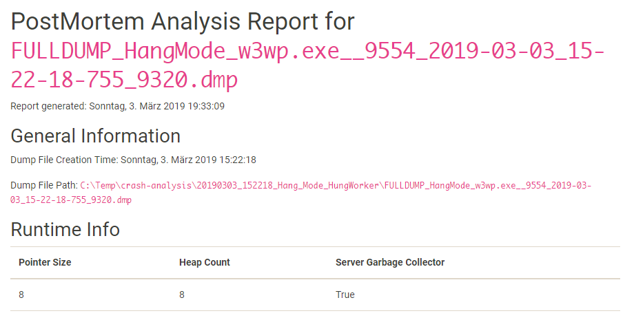
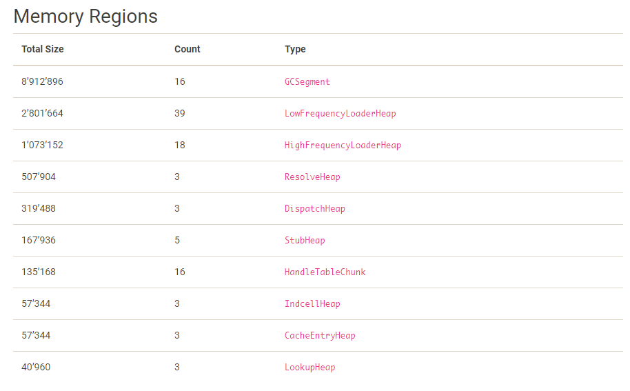
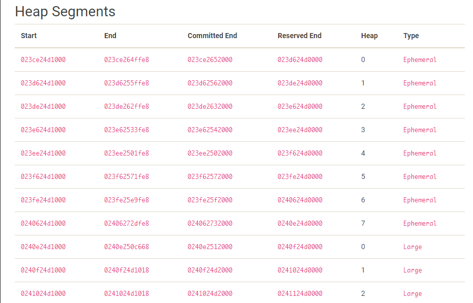
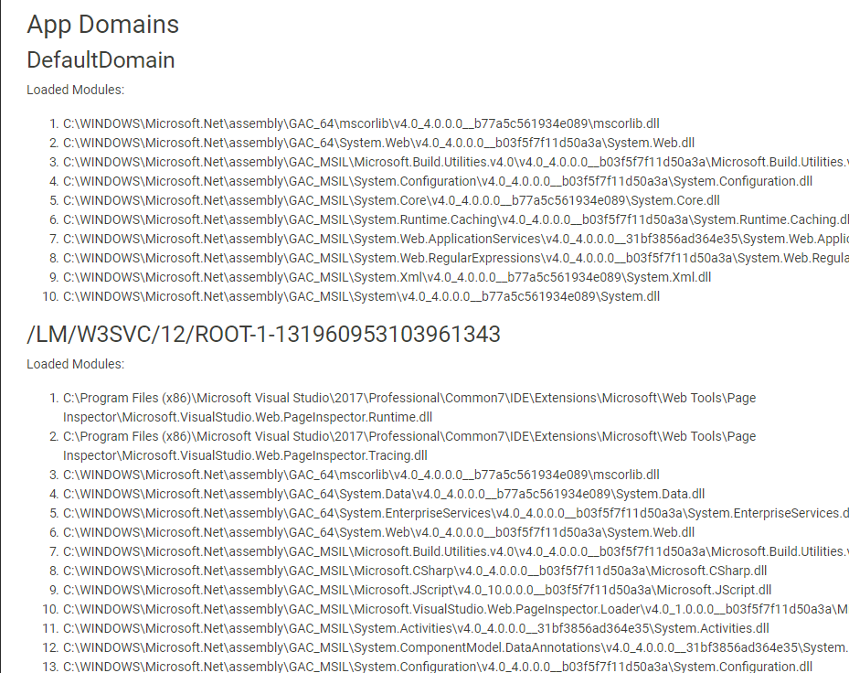
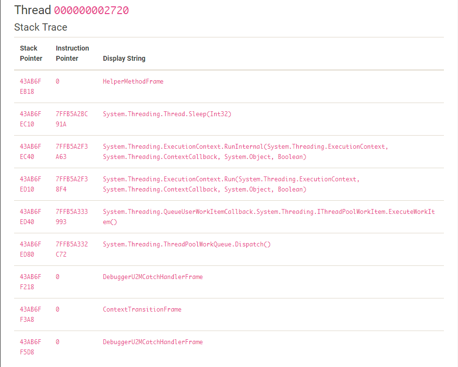
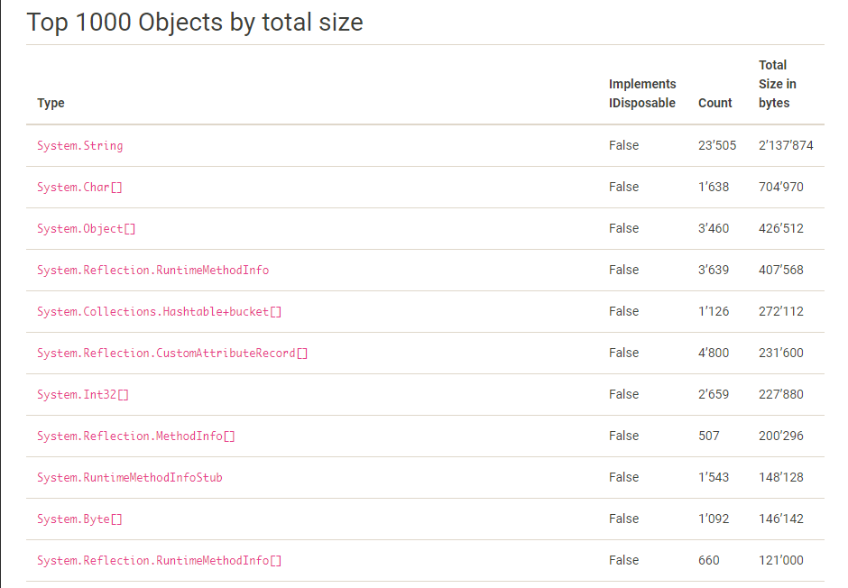

# PostMortem

A simple and basic analyzer for .net memory dumps targeting .net core 2.2 and .net standard 2.0. Reports are provided as `.md` and `.html` files.

The idea and analysing code is heavily inspired (if not just copy-pasted) from the [ClrMD project](https://github.com/Microsoft/dotnet-samples/tree/master/Microsoft.Diagnostics.Runtime/CLRMD).

## Libraries used

- [ClrMD](https://github.com/Microsoft/dotnet-samples/tree/master/Microsoft.Diagnostics.Runtime/CLRMD)
- [ClrMD.Extensions](https://github.com/JeffCyr/ClrMD.Extensions)
- [MarkDig](https://github.com/lunet-io/markdig)
- [Newtonsoft.Json](https://github.com/JamesNK/Newtonsoft.Json)
- [Serilog](https://github.com/serilog/serilog)
- [Serilog.Sinks.Console](https://github.com/serilog/serilog-sinks-console)
- [CommandLineParser](https://github.com/commandlineparser/commandline)

## Usage

Clone this repository and publish it. In the published directory, run
```bash
dotnet .\PostMortem.dll
```
with the following parameters

```bash
  -p, --path          Required. Path to the memory dump

  -v, --verbose       (Default: false) Verbose output

  -o, --output-dir    Required. Directory where the results should be saved

  -s, --path2         Path to the second memory dump

  --help              Display this help screen.

  --version           Display version information.
```

## Features

### Analysis Report

The analysis report provides the following information:

#### Runtime Info

- Pointer Size
- Heap Count
- Flag indicating if Server Garbage Collection is in use



#### Memory Regions

- Total Size
- Count
- Type



#### Heap Segments

- Start
- End
- Committed End
- Reserved End
- Heap
- Type



#### Heap Balance

- Heap
- Size in Bytes


#### App Domains

- Name
- Loaded Modules



#### Threads

- Indication if thread contains exception
- Information about exception, such as type, message and hresult
- Stack trace
  - Stack Pointer
  - Instruction Pointer
  - Method Display String



#### Top Objects

- Displays top 1000 objects by total size
  - Type
  - Indicator if type directly implements `IDisposable`
  - Count / number of instances
  - Total size in bytes

